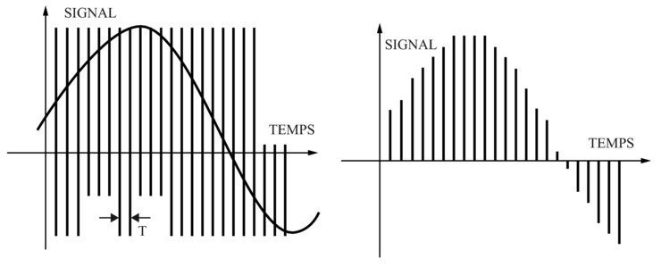
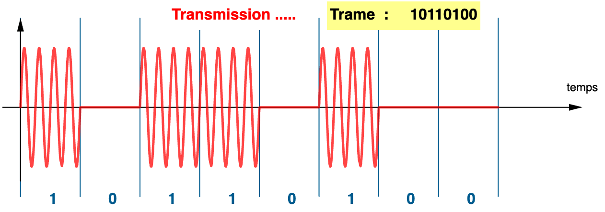

# Projet DosOok

## Les étudiants

- [Cédric COLIN](https://github.com/lynn2910)
- [Marvyn LEVIN](https://github.com/marvynlevin)

## Le projet

Le défi de ce semestre consiste à concevoir un ensemble de deux programmes capables d’échanger des données numériques via un canal audio. Le choix de la transmission par le son émerge en raison de ses propriétés uniques :

- **Utilisation d'ondes sonores** : DosOok utilise des ondes sonores proches des ultrasons ou audibles pour coder les données, éliminant ainsi le besoin de matériel ou d'antennes spécialisés tels que le WiFi, le Bluetooth ou le NFC.

- **Universalité de l'échange de données** : La transmission audio peut s'effectuer entre n'importe quel appareil doté d'un haut-parleur et/ou d'un microphone.

- **Rapidité et sécurité des données** : La technologie Data over Sound assure un transfert rapide de données sécurisées par cryptographie entre deux appareils, contribuant ainsi à une expérience utilisateur sans friction.

### Signaux audio numériques

Un signal numérique est une suite de valeurs définies à des instants dits d’échantillonnage et représentées selon un format donné (8 bits ou 16 bits par exemple).

Le plus souvent, les instants d’échantillonnage sont régulièrement espacés et l’on parle alors de fréquence d’échantillonnage F, comme dans la figure ci-dessous qui illustre comment un signal analogique (à gauche) est numérisé avec une période d’échantillonnage de T=1/F (à droite). Dans le cas de l’audio, la fréquence d’échantillonnage utilisée historiquement pour graver les CDs est de F=44100 Hz, soit 44100 échantillons par seconde. Cette valeur est liée à la bande passante maximale de l’oreille humaine, inférieure à 20kHz.

### Transmission sans fil des signaux audio

Transmettre tels quels des signaux audio dans l’air n’est pas efficace, en particulier parce que leurs propriétés fréquentielles font qu'ils perdent rapidement leur énergie avec la distance. Les modulations, en variant les propriétés du signal (amplitude, fréquence, phase), améliorent la robustesse de la transmission sur de longues distances.

Il existe un grand nombre de variantes de modulations permettant de transmettre efficacement des signaux de type audio sur de longues distances. Vous en connaissez au moins deux : la modulation d’amplitude et la modulation de fréquence.

Dans ce projet, vous allez implémenter une transmission en employant une modulation d’amplitude par sauts dite ASK (Amplitude Shift Keying) dans laquelle une onde porteuse est modulée (multipliée) par la traduction binaire des données à transmettre. La porteuse est simplement une sinusoïde de fréquence connue, que l”on fixera à 1kHz pour rester dans le domaine audible. Pour rappel, en radio FM, les porteuses ont des fréquences autour de 100MHz.

La figure ci-dessous montre la transmission de la trame binaire 10110100. On voit que la porteuse (sinusoïde rouge) est multipliée par 1 ou 0 selon la valeur des bits à transmettre. Le nombre de bits transmis par seconde est appelé le débit et s’exprime en bauds (symboles par seconde).

### Mémorisation des données audio : le format RIFF (WAV)

Afin de pouvoir plus aisément faire la mise au point de vos deux programmes, vous allez mettre en œuvre une mémorisation intermédiaire des signaux audio sous la forme de fichiers .wav. Il s’agit d’un ancien format mais qui demeure employé car sa conception le rend assez versatile. Les paramètres des fichiers .wav sont rangés dans leur entête, dont le contenu est décrit [ICI](https://docs.fileformat.com/audio/wav/).

Pour ce projet, nous nous imposerons les paramètres suivants :

- **Fréquence d’échantillonnage** : 44,1kHz
- **Format de stockage des données audio dans le fichier** : PCM entier (code 1)
- **Nombre de canaux** : 1 (mono)
- **Nombre de bits par échantillon** : 16

### Plus de détails

[Voir les consignes officielles](http://info.iut-bm.univ-fcomte.fr/staff/perrot/DUT-INFO/S1/SAE/2023/)